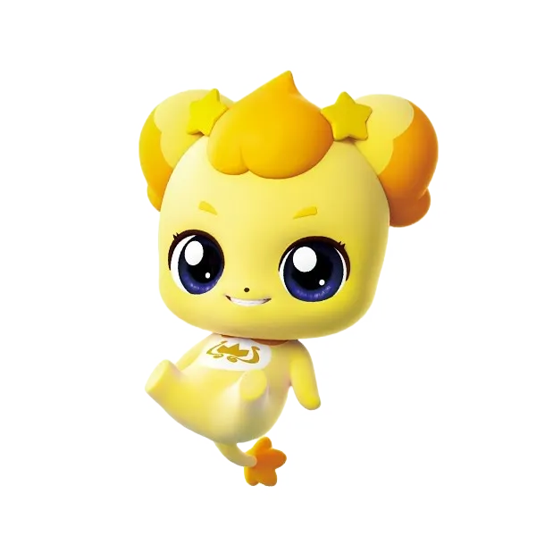

## 🍗반반치킨 Team

|[정준한](https://github.com/junhanjeong)|[이수진](https://github.com/owlemily)|[육지훈](https://github.com/jihunyuk)|[전진](https://github.com/jeenie2727)|[이금상](https://github.com/GeumSangLEE)|[허윤서](https://github.com/Yunseo-Lab)|
|:-:|:-:|:-:|:-:|:-:|:-:|
|<a href="https://github.com/junhanjeong"></a>|<a href="https://github.com/owlemily"></a>|<a href="https://github.com/jihunyuk"></a>|<a href="https://github.com/jeenie2727"></a>|<a href="https://github.com/GeumSangLEE"></a>|<a href="https://github.com/Yunseo-Lab"></a>|

## Members' Role
| Member | Role | 
| --- | --- |
| 정준한 |배치단위 추론코드 작성, EDA, 노이즈 복구, 데이터 증강|
| 이수진 |EDA, 노이즈 복구, 데이터 증강 실험 및 분석|
| 육지훈 |EDA, noise 데이터셋 분리, 앙상블 모델을 통한 리라벨링, 데이터 증강|
| 전진 |EDA, 노이즈 복구, 데이터 증강 실험 및 분석|
| 이금상 |EDA ,cleanlab을 이용한 리라벨링, 데이터 증강|
| 허윤서 |노이즈 분리 및 복구, 데이터 증강, 리라벨링, EDA, 합성데이터 생성|

### 랩업 리포트
- [Wrap-up report](https://drive.google.com/file/d/1E4PA648vFxjWiTyIKY4bYJA_hYUraJ2g/view?usp=sharing)

### 0. 설치
```Bash
$ cd code
$ pip install -r requirements.txt
```
### 1. 코드 설명
- **opt1.py**
	hard 노이즈 분리 버전입니다.
	노이즈 데이터(noise_isolator)를 분리 후, 노이즈 데이터에 eda와 Backtranslation을 이용한 증강과 리라벨링을 수행합니다.
	리라벨링된 데이터를 앞서 사용한 증강 기법을 적용합니다.
	최종적으로 증강된 노이즈 데이터 + 증강된 리라벨링 데이터를 결합하여 최종 데이터셋을 생성합니다.
- **opt2.py**
	soft 노이즈 분리 버전입니다.
	노이즈 데이터 분리 후, 노이즈 데이터(noised_df)와 필터링된 데이터(filtered_df)를 얻습니다.
	노이즈 데이터를 필터링, backtranslation,맞춤법 교정,LLM을 이용한 노이즈 복원,EDA을 적용합니다.
	분리한 두 데이터를 기반으로 라벨 오류를 교정하고 새로운 라벨을 할당합니다. 리라벨링된 데이터를 relabeled_filtered_df에 저장합니다.
	리라벨링된 데이터(relabeled_filtered_df)에 대해 앞서 사용한 증강 기법을 적용합니다
	증강된 노이즈 데이터 + 증강된 리라벨링 데이터를 결합하여 최종 데이터셋을 생성합니다.
	
- **noise_isolation.py**
	노이즈가 있는 데이터와 노이즈가 없는 데이터를 분리합니다.
- **augmentation.py**
	데이터 정제 이후 각종 증강을 수행하는 코드입니다.
	노이즈 필터링 및 LLM을 활용하여 데이터 정제를 수행합니다. 
	이후 단순 변환을 통한 기본 증강, 맞춤법 교정, Back Translation, KoEDA 라이브러리를 활용한 방식으로 데이터를 증강합니다.
- **relabeling.py**
  텍스트 분류 모델을 학습하고 라벨 오류를 검출 및 수정하는 파이프라인을 구현합니다.
  LabelErrorCorrector 클래스는 단일 모델을 통해 라벨 오류를 검출하고 수정하는 기능을 제공하며, ReLabelingEnsemble 클래스는 여러 모델의 앙상블을 사용하여 라벨을 재라벨링합니다.
  이를 통해 텍스트 데이터의 라벨 품질을 개선하고, 수정된 데이터를 CSV 파일로 저장할 수 있습니다.

### 2. 사용법
otp1.py 실행 -> last.csv -> synthetic.py -> synthetic_data.csv
last.csv + synthetic_data.csv(합성 데이터) => 완성

### 3. 참고사항
대회의 자세한 정보는 첨부된 Wrap-Up 리포트를 참고해주세요.

### 5. 디렉토리 구조
```Bash
level2-nlp-datacentric-nlp-03/
├── code/
│   ├── Synthetic/
│   │   ├── synthetic.py
│   │   └── output_data/
│   ├── scripts/
│   │   ├── augmentation.py
│   │   ├── noise_isolation.py
│   │   ├── relabeling.py
│   │   ├── opt1.py
│   │   └── opt2.py
│   └── baseline_code.ipynb
└── README.md
```
